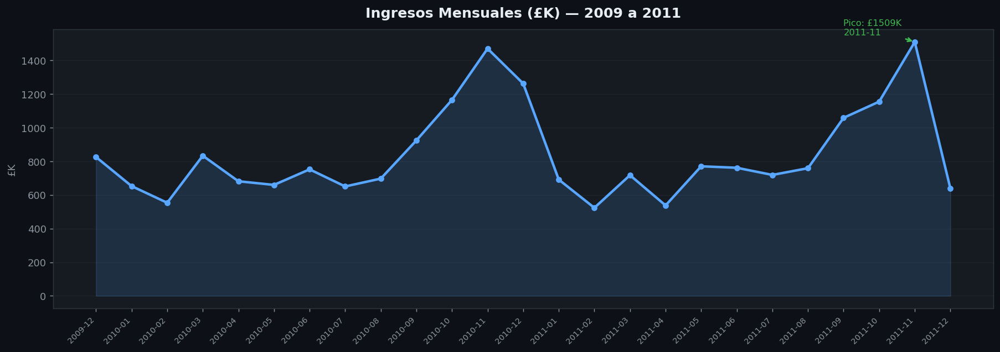
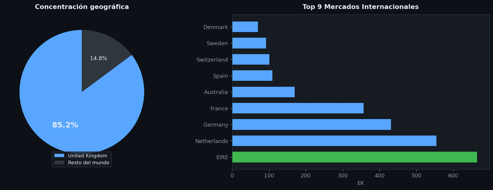
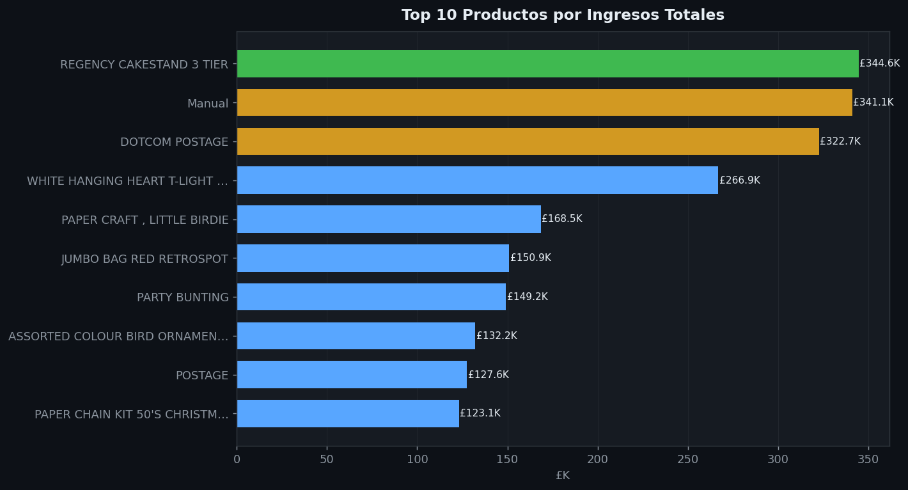
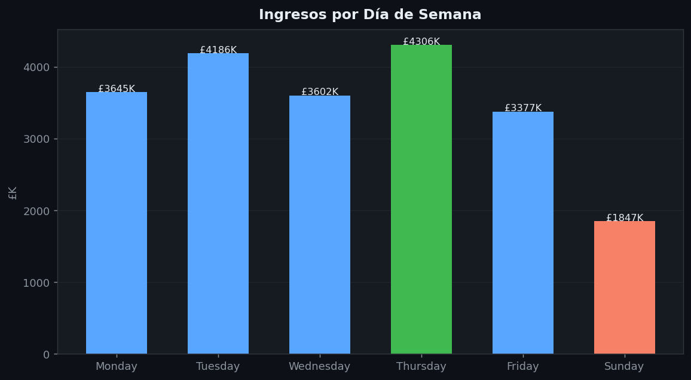
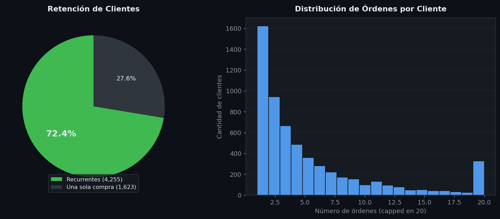

# Retail Revenue Optimization — Online Retail II

Un e-commerce del Reino Unido con ventas globales necesitaba entender su comportamiento de ventas antes de definir la estrategia del año siguiente. Con más de 1 millón de transacciones reales (2009–2011), este análisis responde 5 preguntas críticas de negocio.

---

## Hallazgos principales

| Pregunta              | Hallazgo                                      | Acción recomendada                       |
| --------------------- | --------------------------------------------- | ---------------------------------------- |
| ¿Los ingresos crecen? | Pico en noviembre 2011 — £1,456,776 en un mes | Preparar inventario desde septiembre     |
| ¿Dependencia de UK?   | 83% del revenue concentrado en UK             | Expandir EIRE, Alemania, Francia         |
| ¿Productos clave?     | Top 10 SKUs son el motor del ingreso          | Stock garantizado + mejores márgenes     |
| ¿Cuándo compran?      | Jueves y miércoles son los días peak          | Activar campañas martes–jueves           |
| ¿Retención?           | 72% de clientes identificados regresan        | Programa de lealtad para clientes nuevos |

---

## KPIs del dataset

| Métrica         | Valor               |
| --------------- | ------------------- |
| Revenue total   | £20,972,968         |
| Órdenes únicas  | 40,078              |
| Clientes únicos | 5,878               |
| Período         | Dic 2009 – Dic 2011 |

---

## Visualizaciones







---

## Stack técnico

Python · Pandas · Matplotlib · Jupyter Notebook

---

## Cómo ejecutar

```bash
cd 01-retail-revenue-optimization
pip install pandas matplotlib jupyter

# Descargar el dataset desde:
# https://archive.ics.uci.edu/dataset/502/online+retail+ii
# → colocar en data/online_retail_II.csv

jupyter notebook notebooks/retail_eda_notebook.ipynb
```

---

**Dataset**: UCI Online Retail II · 1,067,371 transacciones · 2009–2011  
**Proyecto siguiente**: [02 — Data Warehouse](../02-data-warehouse-project)
