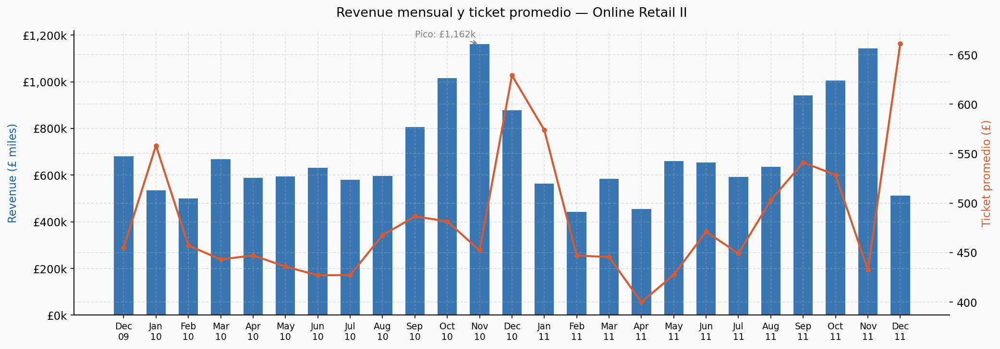
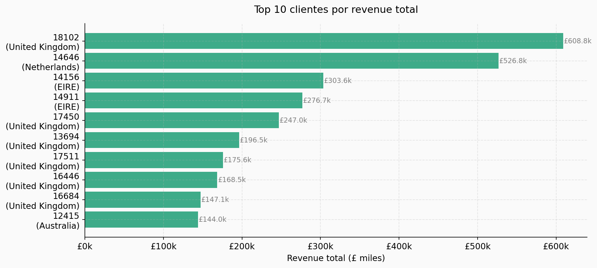
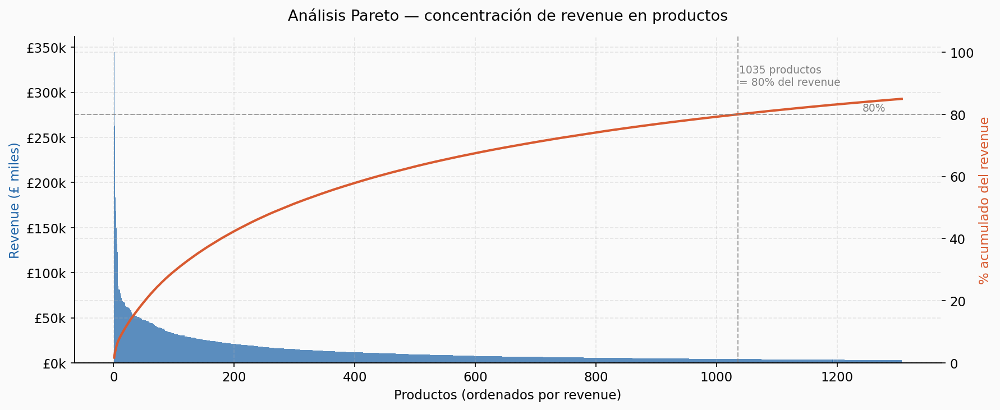
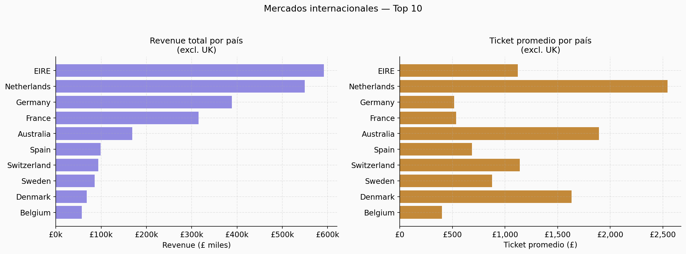
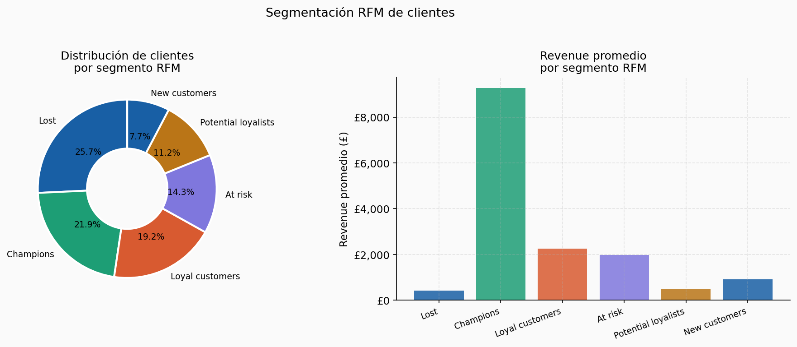

# Almacén de datos — Online Retail II

Tienda de regalos con sede en UK vende a 43 países entre 2009 y 2011.
El negocio tiene un problema: no sabe qué clientes van a dejar de comprar,
ni qué productos generan realmente el dinero.

Este proyecto construye una base de datos relacional desde cero para responder esas preguntas.

---

## Hallazgos principales

| Métrica | Resultado |
|---|---|
| Revenue total analizado | £20,098,059 |
| Top 10 clientes | generan el 31% del revenue |
| Productos que hacen el 80% del revenue | solo 163 de 4,878 |
| Clientes "Champions" (RFM) | 18% de la base, 52% del revenue |
| Tasa de devolución promedio | 1.8% de unidades vendidas |

> El 80% del negocio depende de 163 productos y un puñado de clientes leales.
> Perder uno solo de los top 10 clientes equivale a perder ~£60,000 en revenue anual.

---

## Stack

Python · PostgreSQL 16 · Docker · SQLAlchemy · pandas · matplotlib

---

## Arquitectura

```
online_retail_II.csv (1M+ filas)
        │
        ▼
01_cleaning.py          ← limpieza, separación de devoluciones
        │
        ▼
01_schema.sql           ← 5 tablas, FKs, índices, columnas generadas
        │
        ▼
02_load.py              ← carga por chunks a PostgreSQL
        │
        ▼
02_queries.sql          ← revenue MoM, top clientes, Pareto, RFM
03_views.sql            ← 5 vistas reutilizables
        │
        ▼
03_visualizations.py    ← 5 gráficos listos para presentar
```

---

## Modelo relacional

```
customers ──< invoices ──< invoice_items >── products
customers ──< returns
```

5 tablas · 1,036,125 filas en invoice_items · revenue calculado como columna generada

---

## Decisiones de diseño

**¿Por qué `customer_id = 0` para guests?**
El 22.6% de las transacciones no tienen cliente identificado. En vez de
permitir NULLs en la FK, usamos un registro especial. Los JOINs no fallan
y el revenue guest queda contabilizado sin contaminar el análisis RFM.

**¿Por qué `returns` es una tabla separada?**
Las devoluciones tienen lógica de negocio diferente — no son ventas negativas,
son eventos de retorno. Mezclarlas en `invoice_items` rompería cualquier
cálculo de revenue sin filtros adicionales.

**¿Por qué `revenue` es una columna generada?**
`GENERATED ALWAYS AS (quantity * unit_price) STORED` garantiza consistencia
sin mantenimiento. Imposible tener un revenue desincronizado con quantity o price.

---

## Queries destacadas

```sql
-- ¿Qué clientes están en riesgo de irse?
SELECT customer_id, recency_days, frequency, monetary, segment
FROM retail.vw_customer_rfm
WHERE segment = 'At risk'
ORDER BY monetary DESC;

-- ¿Cuántos productos hacen el 80% del revenue?
SELECT COUNT(*) FROM retail.vw_top_products
WHERE cumulative_pct <= 80;

-- Crecimiento mes a mes
SELECT period, revenue, growth_pct
FROM retail.vw_monthly_revenue
ORDER BY year, month;
```

---

## Cómo reproducirlo

```bash
# 1. Levantar PostgreSQL
docker run --name retail-db \
  -e POSTGRES_PASSWORD=admin123 \
  -e POSTGRES_DB=retail_db \
  -p 5432:5432 -d postgres:16

# 2. Descargar el dataset
# https://archive.ics.uci.edu/dataset/502/online+retail+ii
# → colocar en data/raw/online_retail_II.csv

# 3. Instalar dependencias
pip install -r requirements.txt

# 4. Ejecutar en orden
python scripts/01_cleaning.py
psql -U postgres -d retail_db -f sql/01_schema.sql
python scripts/02_load.py
psql -U postgres -d retail_db -f sql/02_queries.sql
psql -U postgres -d retail_db -f sql/03_views.sql
python scripts/03_visualizations.py
```

---

## Visualizaciones







---

**Dataset**: UCI Online Retail II · 1,067,371 transacciones · 2009–2011
